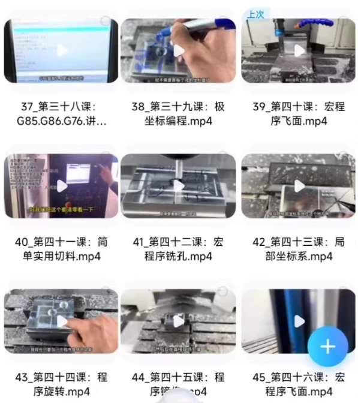
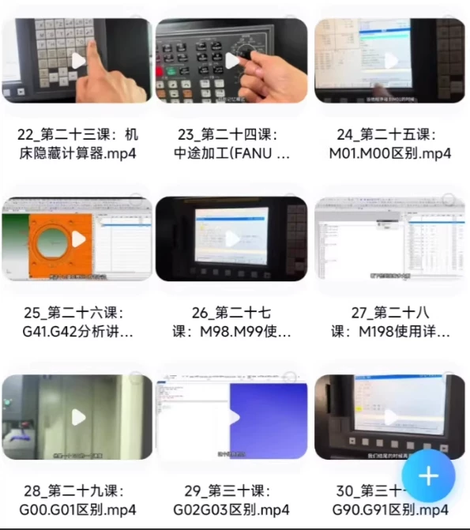
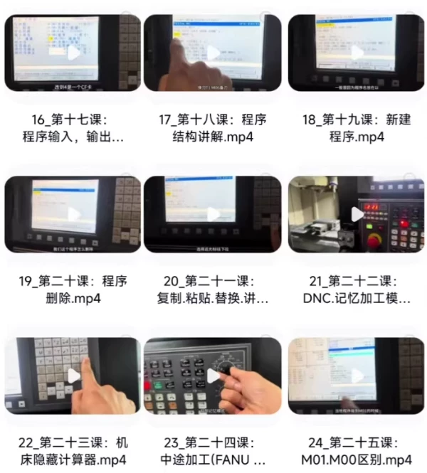

# CNC programming, Macro programming for CNC machine tool

## Body

CNC programming, manual programming macros for CNC milling centers
CNC programming, manual programming macros for CNC milling centers
CNC programming, manual programming macros for CNC milling centers

CNC programming, manual programming macros for CNC milling centers
A total of 53 lessons from simple programming to macros
Click directly
No need for a player, you can watch it on your phone or computer, and also download it

??Note: If you believe that this material infringes upon your copyright, please notify me immediately so I can remove it.
The item marked 2 is the appropriate reward for organizing this material, only for those who are interested in learning.
The seller respects the intellectual property rights of the original author and publisher, supports the original author and publisher, thank you.

Delivered via cloud storage, since virtual items can be copied, refunds are not available, if you don't like it, please don't buy.
If you are interested, click "I want" and private message me.

## Images

## Payment

Here is a pay link on Stripe ( https://buy.stripe.com/3cs8yP7sY87d0vu9AB ). Please contact me lonlonago@foxmail.com after funding $89, and I will send you a complete data files , thank you!

